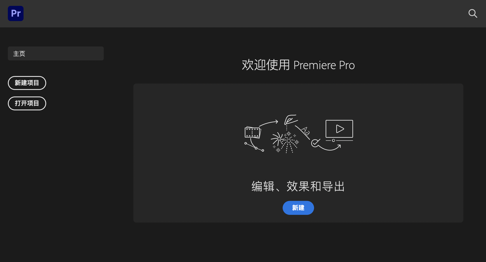
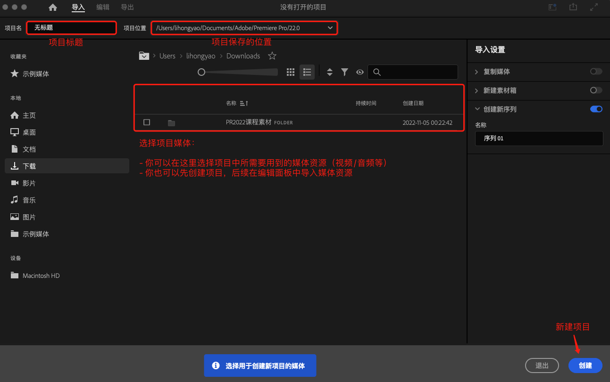
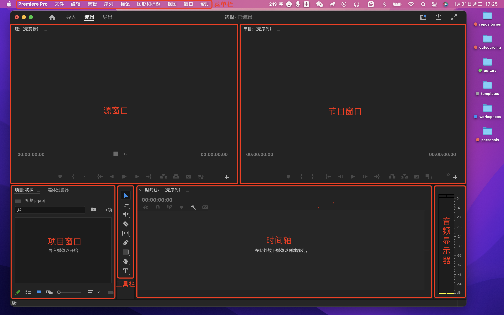
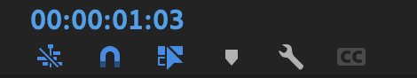

# 软件安装

资源下载：http://pr.njais6.cn/?bd_vid=9853370652611795370#header

> **提示：**我安装的是收费的，需要 RMB 58.00 元，永久使用。

根据教程安装完成之后，打开PR，进入欢迎页面，如下所示：

# 首选项设置

首选项设置类似于手机通用设置，这里简单列出重要的部分，可以根据自己的需求设置：

- 音频硬件选择
- 自动保存

- 媒体

  - 默认媒体缩放 - 「设置为帧大小」

    > *场景：假设创建的序列是1920x1080，视频素材为720，此时序列中会出现黑边，因为视频没有铺满序列，通常我们会选中视频，然后鼠标右键将其「缩放为帧大小」，当素材比较多的时候操作起来比较麻烦，我们可以在首选项中统一设置*
  
- 媒体缓存，根据自身需求设置

- 时间轴

  - 视频过渡默认持续时间（*两段视频添加过渡效果时默认的持续时间*）
  - 音频过渡默认持续时间（*两端音频添加过渡效果时默认的持续时间*）
  - 静止图像默认持续时间（*添加图片素材时默认持续的时间*）

# 快捷键

- 删除空隙（两端素材之间的空隙需要删除时）
  - 右键选择「波纹删除」
  - Delete
  - 菜单栏 → 序列 → 封闭间隙
  
- 快速剪辑（时间轴上删除不用的素材）
  - 剃刀工具（留空隙）
  - 移动工具，直接将光标放置在素材首位拖拽可删除前后（留空隙）
  - 快捷键 `B` 波纹编辑删除
  - 拨动时间轴，`Q` 键删除时间轴前面的素材，`W` 键删除时间轴后面的素材
  
- 调换素材位置
  - 按住 `Command` + `Option` 键，选中要调换位置的素材将其拖拽至指定位置
  
- 多轨道裁剪素材
  - 单轨道：`Command` + `K`
  - 多轨道：`Command` + `Shfit` + `K`
  
- 片段式抽取素材
  - 在时间轴上需要对某一段素材进行抽取，可以打上 `I` 跟 `O` 的出入点进行区间选择之后按住键盘的冒号（`:`）键，这段素材就会被截取出来了，然后在需要粘贴的任意R位置按住 `Command` + `V`，这段素材就会被单独的粘贴出来，通过这种方法也可以进行删除素材，还是一样的选出好区间之后，按住双引号（`""`）键，这段素材会自动的往前进行吸附，而且还被删除了。
  
- 素材粘贴技巧
  - 快速复制素材：配合快捷键 `Option` 键，拖拽素材
  - 粘贴素材属性：这个功能可以把素材当中的视频效果、关键帧参数、音频参数进行快速的复制，首先选中目标素材，右键复制，然后选中需要应用的素材，右键选择「粘贴属性」，这些素材就拥有和目标素材同样的属性了。
  
- 取消音视频链接：`Command` + `L`

- 截取 + 拖拽
  - 在源窗口中截取好素材的范围后选择「仅拖拽音频」或者「仅拖拽视频」至时间轴上
  - 在源窗口中截取好素材的范围后直接将视频拖拽至时间轴上（同时拖拽音频和视频）
  - 在源窗口中截取好素材的范围后将视频拖拽至节目窗口
  
- 速度操作技巧
  - 为某段素材调整速度，点击素材右键选择「速度/持续时间」，速度大于100是快速，小于100是慢速
  - 使用比例拉伸工具（`R`），通过拨动素材的长度控制播放速度
  
- 帧定格操作
  - 选中素材右键选择「添加帧定格」，定格当前帧，覆盖后面的内容
  
  - 选中素材右键选择「插入帧定格片段」，定格当前帧（默认2s），后面的视频不受影响
  
    > 提示：如果你觉得2s太短，也可以切换至「波纹编辑工具（`B`）」拖拽定格片段的长度。

# 基础操作

## 新建项目

新建项目是剪辑的第一步

1）快捷键：`Option` + `Command` + `N`

2）文件 → 新建→ 项目

> **提示：** PR 项目文件的后缀名为 `.prproj`，类似于 PS 文件后缀名 `.psd`。

## 工作面板

整体来看，PR基础面板主要分为7大板块：菜单栏、源窗口、节目窗口、项目窗口、工具栏、时间轴和音频显示器。

如下图所示：

每一个面板下，又包含一些小的面板。

> **提示：**基础面板下方的小面包在你首次使用时有些面板可能被隐藏了，你可以在：菜单栏 → 窗口 中选中相应面板展示。

## 新建序列

新建序列是剪辑的第二步

新建序列是作为一个载体存在的，是非常基础且重要的操作步骤之一。

快捷键：`Command` + `N`，进入序列面板：

- 编辑模式：自定义

- 时基：时基的意思就是帧数，帧指的是一张张图片，帧数也就是1秒钟时间内传输的图片张数

  - 24帧为电影帧率的标准，24帧、25帧、30帧或者60帧都可以，按照需求选择

- 帧大，指的是画面大小的意思，又分为标清、高清、超高清。

  - 标清：4:3的格式，比例就是 512\*384 大小的，老式设置（基本不用）
  - 高清：最常用的
    - 横屏：1920\*1080 1280\*720 16:9比例大小
    - 竖屏：1080\*1920 720\*1280 9:16比例大小
  - 超高清：4K画面大小有很多，例如：4096\*2160 3840\*2160 4096\*3112 3656\*2664

  具体的可根据相机拍摄的大小决定

- 像素长宽比：选择 「方形像素」

- 场序：选择「无场（逐行扫描）」

  - 无场就是不分单双数进行逐行扫描
  - 通常用于互联网电脑视频使用，也是现在所使用的

## 导入素材

导入素材是剪辑的第三步，**导入素材有以下几种方式**：

1）在项目窗口鼠标右键，选择「导入」

2）直接双击项目窗口空白区域，弹出导入窗口

3）菜单栏 → 文件 → 导入

4）快捷键：`Command` + `I`

5）将需要的素材直接拖拽进项目窗口

**PR软件支持导入素材的类型：**

- 视频格式
  - MP4：最常用/体积小/画质好/常用编码H264
  - MOV：带透明通道的视频格式
  - AVI：体积大/画质好/压缩格式不统一
- 音频格式
  - MP3：最常用/体积小/音质好
  - WAV：无损格式/体积大/音质好
- 图片格式：JPG/PNG/TIFF/PSD/图片序列

> 备注说明：
>
> - 不支持导入：加密文件
>
> - 可存放的类型：图片、视频、音频、字幕、序列
>
> - 及时做好素材管理（软件外）：PR剪辑中请勿移动素材位置，做好素材的管理，剪辑一个项目时，将所有的素材分门别类的管理，比如音频/视频/图片等。

**PR中（软件内）如何正确的管理素材？**

我们可以在项目窗口新建素材箱，将对应的素材拖入其中，新建素材箱的方式如下：

- 在项目窗口右键，选择「新建素材箱」
- 菜单栏 → 新建 → 素材箱
- 项目窗口面板三条横线处点击选择「新建素材箱」
- 快捷键：`Command` + `B`

## 认识源窗口

在项目窗口双击视频素材即可 **激活** 源窗口。

**📌 知识点1：**

源窗口中，左下方的蓝色数值（如：00:00:01:00）表示的是当前播放时长，右下角的灰色数值表示素材总时长。

**📌 知识点2：**在源窗口中截取素材及拖拽素材

有时源素材视频特别长，当我们需要截取素材中的某几段进行编辑时，我们可以通过「标记入点」（快捷键 `I`）和「标记出点」（快捷键 `O`）截取视频，然后选择拖拽音频或视频至音频轨道或视频轨道即可。

**📌 知识点3：**如何巧妙的使用标记点？

标记点（快捷键 `M`），类似于备忘录，当我们在剪辑的时候，在某一帧上需要在后续做什么处理时可以添加一个标记来提示我们后续的操作。添加标记点后双击标记可以编辑标注信息。

**📌 知识点4：**插入/覆盖

当你从源窗口中截取了某段素材想要将其拖拽至时间轴上时，有以下几种方式：

- 打好标记入点和出点后，选择拖拽视频将其拖拽至时间轴上的指定位置
- 在时间轴上将【帧把手】拖拽至指定片段，然后在源窗口工具栏选择插入或替换
- 在时间轴上将【帧把手】拖拽至指定片段，然后在源窗口工具栏按住拖拽视频按钮将其拖拽至节目窗口（推荐）

**📌 知识点5：**导出帧

当我们需要将视频中的某一帧单独导出成一张图片时，可以使用「导出帧」工具。

快捷键：`Shift` + `E`

## 认识节目窗口

节目窗口是实时播放我们在剪辑当中的一些画面是长什么样的，通过节目窗口可以进行查看。

节目窗口和源窗口的大部分功能都比较相似。

**📌 知识点1：**播放指示器

同源窗口，左下角表示当前播放时长，右下角表示总时长。

**📌 知识点2：**标记入点/出点

在源窗口中，标记入点和出点的主要用于：「**截取并拖拽素材**」

在节目窗口中，标记入点和出点的主要用于：「**单独渲染或导出选中区域**」

**📌 知识点3：**标记点

节目窗口的标记点会将标记点打在刻度尺上。

> **提示：**源窗口和节目窗口是独立的，二者相互不受影响。

## 认识时间轴

时间轴简单理解就是剪辑的工作台，对素材的剪辑工作处理，全部是在时间轴上进行完成的。

时间轴分为：**视频轨道** 和 **音频轨道**

关于轨道认识的5个知识点：

1. 如何加载素材到时间轴上

   - 在源窗口中通过标记入点和出点截取素材，然后拖拽视频至时间轴上即可
   - 在项目窗口当中直接把素材拖拽到时间轴上再进行剪辑

2. 轨道如何放大缩小

   - 整体：滑动时间轴下方的轨道块，或者按住 `Option` 键滑动滚轮放大缩小
   - 局部（单个轨道）
     - 鼠标双击轨道即可放大还原
     - 鼠标放置在轨道之间，出现等号和上下箭头的图标时可以拖拽轨道实现放大缩小
     - 快捷键：`Command` + `「+|-」` 可以 **展开或还原** 所有的 **视频轨道** 
     - 快捷键：`Option` + `「+|-」` 可以 **展开或还原** 所有的 **音频轨道**

3. 轨道上的工具

   - `V` 表示视频轨道，`A` 表示音频轨道
   - 切换轨道锁定：表示锁定轨道，轨道锁定之后不可编辑
   - 切换同步锁定：基本上用不到
   - 切换轨道输出：显示或隐藏素材
   - 画外音录制：录制声音
   - `M`：静音轨道
   - `S`：独奏轨道

4. 如何进行添加轨道

   - 视频往空白区域进行拖拽

   - 在空白区域右键选择「添加轨道」

     > 提示：删除轨道操作类似

5. 下图展示的几个按钮不要动它，将前3个按钮保持蓝色状态即可：

   

   

## 认识工具栏

   工具栏在项目窗口和时间轴之间，工具栏集合了所有的视频剪辑工具，有一些是非常实用的， 有一些就比较鸡肋了。这里主要介绍一些实用型的，鸡肋的就一笔带过。

   - 选择工具，快捷键 `V`，其功能如下：

     - 拖拽素材

     - 在时间轴上移动素材，可以将某个素材往别的轨道上移动

     - 在时间轴上复制素材，在选择工具模式下，选中素材，按住 `Option` 键可以复制素材

     - 裁剪素材，在时间轴上如果你要删除某段素材前面或后面的内容，只需将鼠标放在素材左右边缘拖拽即可删除
     
       > 提示：删除之后留下的空白区域有三种处理方式：
       >
       > - 将后面的素材往前拖填补空白区域
       > - 选中空白区域按 `Delete` 键删除空白
       > - 在空白区域鼠标右键选择波纹删除

   - 剃刀工具，快捷键 `C`，用于裁剪素材，将某个素材一分为二，通常结合选择工具使用

   - 钢笔工具，快捷键 `P`，类似于PS中打好一个区间范围进行抠图，在PR中可以打关键帧

     > 提示：如果没有显示关键帧，点击时间轴上的🔧，选择「显示视频关键帧」即可。

   - 文字工具，快捷键 `T`，在节目窗口点击输入文字后，选中文字鼠标右键可以编辑文字属性。

   - 波纹编辑工具，长按可唤醒组合工具

   ## 认识新建项

   新建项在项目窗口下方，如下图所示：

   

   

   包含几个实用功能：

   - 序列
   - 项目快捷方式：类似于新建项目
   - 脱机文件：一般是在剪辑的过程中，比如有一段没有拍摄好，后续再拍，但是现在想要看整体效果，那么没有拍好的那一小段可以用脱机文件来表示，其实简单理解就相当于是替补，占位。
   - 调整图层，不会覆盖其他轨道素材，类似于蒙版，可以调色什么的
   - 彩条，用于搞笑视频，自带音效
   - 颜色遮罩
   - 通用倒计时片头

   ## 如何取消视音频链接

快捷键：`Command` + `L`

前面介绍源窗口时，我们知道，通过标记入点和出点截取视频之后我们可以单独拖拽视频或者音频至时间轴。当我们从项目窗口或者源窗口直接将整个素材拖拽至时间轴上时，音频和视频是连接到一起的，会被一起拖拽到时间轴上，有时我们可能只需要整体拖拽视频或者音频，这个时候我们就需要取消视音频链接，操作方法是：时间轴上选中素材 → 鼠标右键 → 点击「取消链接」，该操作可逆向，即未链接的音频和视频链接到一块。

区分某个视频是否连接音频的方法是，观察视频轨道素材的名字是否存在 「V」，如果存在则表示已链接。

## 什么是关键帧

关键帧主要用于记录素材的大小、位置、不透明度甚至是一些角度等数值的一个变化过程（类似于CSS中的Transition）。

关键帧的作用对象：视频素材、音频素材、文字，甚至还有一些图片或者蒙版以及滤镜。

关键帧可以控制素材（音频/视频/文字等）渐入渐出的效果，如果你的音频或者视频上没有显示关键帧，点击🔧勾选显示音频或者视频关键帧。通过 「钢笔工具」 可以打关键帧。

# 效果练习

## 文字效果

### 书写文字

- 文字工具 → 添加文本 → 设置样式

- 选中文字，鼠标右键选择「嵌套」，这样做的目的是为了在后续操作文字书写动画轨迹时不那么卡。
- 在「效果」栏搜索「书写」，然后将其拖拽至文本上
- 将时间轴上的刻度线拖拽至0的位置，选择效果控件
- 「书写」下方，选中「画笔大小」，调节画笔并且设置画笔颜色（默认白色，尽量将画笔颜色和文字颜色设置成对比强的便于观察）
- 将画笔拖拽至文字开始位置，点击「画笔位置」前面的按钮（「切换动画」）打上第一针，然后选中画笔大小，按方向键右键，按几次为切换几帧，依次拖拽画笔模拟书写，知道书写完你填写的文本
- 将「绘制样式」设置为显示原始图像
- 将特效音拖拽至音频轨道上
- 选中「比率拉伸工具`R`」 ，在「嵌套文本」尾部拖拽起长度，使得声音和动画同步。
- 在「效果」搜索「快速模糊」，然后将其拖拽至视频轨道上
- 在「效果控件」里设置第一帧的「模糊度」数值，点击模糊度前面的按钮（「切换动画」）打上第一帧，然后拖拽时间线到指定位置，输入模糊度的值打上第二帧。在关键帧上鼠标右键可以设置速度曲线。
- 上下摆边效果：矩形工具，在视频顶部拖一个块，宽度铺满，填充颜色，然后 `Command` + `C/V` 复制粘贴一份出来将其拖拽至底部。

### 玻璃水文字

新建序列：`Command` + `N` 

1）首先拖拽内容视频至视频轨道，然后将玻璃雨水效果的视频拖拽至内容视频轨道上方

2）在效果栏搜索「Brightness & Contrast」（即「亮度 & 对比度」），将其拖拽至玻璃雨水效果的视频上

3）在「效果控件」中，亮度 10，对比度 -40，混合模式设置成强光

4）在效果栏搜索「快速模糊」，将其拖拽至内容视频轨道上，在「效果控件」中，设置模糊度 75

5）「文字工具」添加文本，随意添加

6）在效果栏搜索 「交叉溶解」，将其拖拽至文字的前后实现淡入淡出效果（当然你也可以通过钢笔工具打关键帧的形式实现）

### 文字消散

1. 拖拽内容视频
2. 添加文字
3. 拖拽黑白素材
4. 文字新增「轨道遮罩键」效果
   - 遮罩：选择黑白素材
   - 合成方式：选择亮度遮罩
   - 反向：勾选
5. 拖拽粒子素材，在效果控件中将「混合」设置为「滤色」，并调整粒子素材的位置及大小
6. 加入音频
7. 加入背景音乐

### 冲浪文字

1. 添加文字，设置样式
2. 添加「湍流置换」效果 
   - 数量30
   - 大小30
3. 在「偏移（湍流）」上打关键帧，第一帧不动，第二帧设置为1800（*根据需求调整*）左右
4. 全选关键帧， 鼠标右键选择「临时插值」，设置「缓入」「缓出」

### 电影片尾文字

1. 操作：「基本图形」 →「编辑」→ 「新建-文本」
2. 填写片尾报幕文字
3. 操作：「效果控件-适量运动」中打关键帧调整位置
   - 开始帧：第一行文字在最底部超出屏幕
   - 结束帧：最后一行文字在最顶部超出屏幕
4. 选中开始帧和结束帧，右键设置效果

### 故障文字

1. 添加文字，设置样式

2. 添加「VR 数字故障」效果，调整参数

   - 自动 VR 属性：取消勾选
   - 帧布局：立体 - 上/下

3. 打关键帧

   - 第一帧
     - 扭曲-颜色演化（默认数值）
     - 随机植入：20
   - 第二帧
     - 扭曲-颜色演化：40
     - 随机植入：60

### 立体文字

1. 将视频素材拖拽至视频轨道1，然后按住 `Option` 键盘拖拽复制一份至视频轨道3，视频轨道2待会儿放文字用。

2. 在「效果」栏搜索「裁剪」，将其放置在视频轨道3上，然后在「效果控件-裁剪」中选择「钢笔（自由绘制贝塞尔曲线）」进行抠图

3. 抠图选区闭合之后，「效果空间-裁剪-左侧」设置为100%，然后将轨道1的视频隐藏查看一下效果

4. 此时节目窗口还有你刚刚抠图的线，这是因为你当前选中的是「蒙版」，在「效果面板」单击空白区域即可隐藏

5. 添加文字，放置在视频轨道2，然后添加从下往上的帧动画即可

## 批量打字幕

- [ARCTIME >>](https://arctime.cn/index.html)
- [剪映 >>](https://www.capcut.cn/)
  - 在PR中剪辑好视频之后将其导出
  - 将导出的视频导入到剪映当中
  - 在「文本」菜单栏中选择「智能字幕」→ 「识别字幕-开始识别」
  - 识别好之后，选择「导出」，这里只勾选「字幕导出」，字幕格式选择「SRT」
  - 打开PR，将下载好的字幕拖拽到时间轴上
  - 点击字幕可以打开字幕面板，然后你可以修改字幕

## 变速效果

1. 拖拽素材视频至时间轴，双击视频轨道将其展开
2. 在素材视频标题左侧 $fx$ 上鼠标右键选择「时间重映射-速度」，此时出现一根「速度调整线」
3. 拨动时间刻度，通过「钢笔工具」在「速度调整线」上打关键帧标识出需要变速的区域
4. 切换至「选择工具」，拖拽变速区间。
   - 往上拖：加速
   - 往下拖：减速
5. 左右拖拽关键帧处的按钮可以控制变速的速率，使其变得更加缓和。

## 转场效果

### 漫画转场

1. 拖拽素材视频至时间轴，使用剃刀工具裁剪素材分成两段
2. 效果栏搜索「Extract」拖拽至第一段素材上，将时间刻度调整至两段素材正中间，然后往左偏移5帧
3. 然后在「效果控件」中打关键帧（结束帧）：
   - Black Input Level 不用修改值
   - White Input Level  不用修改值
4. 最后将「帧把手」拖拽至第一段素材的第一帧，再打一个关键帧：
   - Black Input Level 设置为 0
   - White Input Level  设置为 0
5. 框住关键帧，右键设置「缓入」「缓出」

两段素材切换过渡比较突兀，可以添加视频过渡效果，在效果栏搜索「交叉溶解」将其拖拽至两段素材之间即可

### 瞳孔转场

素材：眨眼/隧道

1. 拖拽眨眼素材，在眼睛睁开后的位置右键选择「添加帧定格」
2. 选中帧定格片段，在「效果控件」打关键帧（第1帧-「缩放」「位置」「锚点」）
3. 向右拖拽时间刻度线（15帧左右，根据需求而定），打第2帧
   - 缩放：使得瞳孔放大，直到瞳孔黑色部分完全覆盖显示区域
   - 位置：辅助设置缩放使其从正中心开始缩放
   - 锚点：辅助设置缩放使其从正中心开始缩放
4. 回到帧定格片段第1帧的位置，在「效果面板-不透明度」选择椭圆蒙版，圈住眼眸部分。
   - 设置蒙版羽化 30
   - 勾选「已反转」
5. 将「帧定格片段」向上移动一个轨道，然后将后面的隧道往前拖即可完成效果
6. 处理突兀：将「帧定格片段」突兀处切一刀，复制一份下来，和后面的轨道设置「交叉溶解」过渡效果

### 无缝转场

A → B ：A素材画面通过遮挡物平滑过渡切换到B素材以达到无缝的转场。

1. 在第1段素材遮挡物刚好「完全进入」呈现在屏幕中时的位置打上1个标记（便于后面将第2段素材拖拽至此处）
2. 然后选中第1段素材
   - 在「效果控件 - 不透明度」中选中「钢笔/椭圆/矩形」创建蒙版，勾选「已反转」，然后在屏幕右侧（延伸到屏幕外）绘制蒙版区域（蒙版区域左侧路径根据遮挡物刚完全出现时在屏幕上的形状绘制），然后在「蒙版路径」上打关键帧（第1帧），
   - 当遮挡物刚好移出屏幕时，打上第2帧，然后将蒙版左侧拖拽至遮挡物移出的位置
3. 将第2段素材拖拽至刚刚打的标记处即可完成效果
4. 优化：调整蒙版羽化值，使得转场不那么生硬

### 镜头移动转场

1. 准备两段素材，拖至轨道1

2. 将「新建项」- 「调整图层」放置在时间轴上（轨道2），位于两端素材的正中间

3. 设置位移效果

   - 效果栏将「视频效果 - 扭曲 - 偏移」拖拽至「调整图层」

   - 在「效果控件」中「将中心移位至」打关键帧
     - 第1帧：无需改动
     - 第2帧：拖拽一段距离，设置数值为X轴的10倍，然后将这个关键帧拖拽至「调整图层」最后

4. 设置模糊效果

   - 效果栏将「视频效果 - 模糊与锐化 - 方向模糊」 拖拽至「调整图层」

   - 在「效果控件」中「模糊长度」打关键帧

     - 第1帧：无需改动
     - 第2帧：中间位置，设置模糊长度130（建议100-150之间）
     - 第3帧：最后，重置模糊长度为0

## 开场片头-vlog

1. 摆裙效果
   - 拖拽「裁剪」效果至视频素材
   - 在「裁剪 - 顶部/底部」打关键帧 
     - 第1帧：2s位置处（根据需求设置），无需改动
     - 第2帧：往后拉一段距离，在合适位置，修改关键帧（顶部/底部）的值
     - 框选关键帧，右键选择「缓入/缓出」
2. 新增文字
   - 将文字拖拽至第3轨道
   - 将视频轨道1的素材按住 `Option` 键复制一份至视频轨道2，删除「裁剪」效果（这里只删除视频轨道2的裁剪效果）
   - 效果栏搜索「轨道遮罩键」将其拖拽至视频轨道2上
   - 在「效果控件」中，「遮罩」选择「视频3」
   - 优化处理
     - 根据音频节奏，控制文字和轨道2出现的位置
     - 根据音频节奏，控制文字和轨道2消失的位置
     - 确定好位置之后，在文字和轨道2消失的位置，选中视频轨道1/2/3， `Command` + `Shift` +  `K` ，删除多余部分
     - 将轨道2和轨道3全部选中，鼠标右键选择「嵌套」
     - 效果栏搜索「交叉溶解」拖拽至刚刚「嵌套」素材的前后位置处以及视频轨道1结束的位置
3. 新增导演文案，放置在视频轨道1素材后面，添加「交叉溶解效果」，删除多余的音频，完成创作。

# 使用技巧

## 去除水印

主要推荐以下5中方法

- 中间值

  可根据背景颜色进行快速遮罩遮挡，也是我最常用的

  - 效果栏搜索「中间值」拖拽至视频素材上
  - 创建蒙版，框住水印区域
  - 调整「半径」数值即可

- 高斯模糊

  与中间值有些相似，但相对于而言，它的遮罩在变化时不会进行根据背景变化而变化

  - 效果栏搜索「高斯模糊」（视频效果）拖拽至视频素材上
  - 创建蒙版，框住水印区域
  - 调整「模糊度」数值即可

- 马赛克

  这个效果在画面中会形成小块范围的效果，也可适用于面部遮挡

  - 效果栏搜索「马赛克」（视频效果）拖拽至视频素材上
  - 创建蒙版，框住水印区域
  - 调整「水平块/垂直块」数值即可

- 效果控件

  把画面进行放大，缺点就是会缺失画面的很多部分

  - 效果控件调整缩放数值

- 上下黑白边

  也就是画面上下的遮挡，也会缺失部分画面效果，但是会有种电影感

  - 上下添加矩形区域

## 声音相关

### 背景音乐及人声处理技巧

如何让bGM随着人声进行实时变化音量的？在我们后期剪辑过程中，一般素材会有人声、背景音乐甚至是音效同时出现的这个阶段，在处理时，我们一定要分清主次关系，正确处理方式如下：

1. 唤醒「基本声音」面板，如果你的PR没有显示，在「窗口 - 基本声音」勾选即可展示面板。
2. 选中音频，在「基本声音」面板选择该段音频对应的类型
   - 人声，选择「对话」
   - 背景音乐（bGM），选择「音乐」
   - ...
3. 对于bGM，在「基本声音」面板勾选「回避」，根据需求调整各项数值，最后点击「生成关键帧」

### 配音如何加速变调

如何让音频加速或减速的时候不变调呢？在剪辑的时候，如果你想要保持某一段的素材给它加速的操作，但是又不想变调，可以这样处理：

1. 方法1：使用「速度/持续时间」控制
   - 选中音频，鼠标右键选择「速度/持续时间...」
   - 调整速度：大于100为加速，小于100为减速
   - 勾选「保持音频音调」
2. 方法2：使用「音高换挡器」
   - 在效果栏搜索「音高换挡器」拖拽至音频上
   - 在「效果控件」中点击编辑打开「自定义设置」
   - 设置比率：`1 / x%`，其中 `x` 表示调整速度的具体数值（大于100为加速，小于100为减速）
     - 比如，速度为 120%，则比率为：`1 / 120% === 1 / 1.2 === 0.83333`
   - 精度选择「高精度」
   - 勾选「使用相应的默认设置」

### 如何统一音量且声音变大时不爆音

在音频轨道工具栏位置有一个麦克风的图标，点击可以进行「画外音录制」

> 提示：如果你的图标呈现的是灰色，你需要将鼠标悬浮在该图标上，右键选择「画外音录制设置..」更改 「源 / 输入」

当我们录制音频时，可能由于远近的不同导致音量不同，那如何统一音量呢？

1. 将有问题的那一段单独切出来选中
2. 在「基本声音」中选择对话，在「响度」中点击「自动匹配」

当你统一音量之后可能会觉得声音还是特别小？我们可以直接把音量拨高，这样操作可能会导致音爆，那我们应该如何在调高音量的同时又使得声音不过爆呢？我们可以通过效果实现：

1. 效果栏搜索「强制限幅」拖拽至有问题的那一段音频上
2. 点击编辑打开「自定义设置」
3. 预设选择「限幅 - -6db」
4. 勾选实际峰值
5. 根据需求微调「最大振幅」和「输入提升」即可

### 关于声音的案例合集

**📌 1. 声音如何渐入渐出？**

1. 方法1：音频添加「指数淡化」效果
2. 方法2：打关键帧

**📌 两端音乐如何实现过渡自然**？

为两段音乐添加「恒定增益」效果，类似于视频过渡。

**📌 如何制作断电效果？**

1. 首先准备一段音频
2. 为音频素材添加「音高换挡器」效果
3. 在效果控件中自定义设置打开编辑，预设更改为「默认」
4. 点击素材，时间轴拖拽至需要进行变调的位置，打开「各个参数」下的「变调比率」打上关键帧
   - 第1帧：设置参数保持为1
   - 第2帧：比第1帧低，比第3帧高
   - 第3帧：设置参数最低
5. 最后在时间轴的关键帧上打上淡入淡出效果（钢笔工具）即可。

**📌 如何制作模拟水下声音？**

1. 效果栏搜索「低通」放置在音频素材中
2. 在效果中把「切段」调整到 200-800赫兹（*入水越深，数值越小*）

